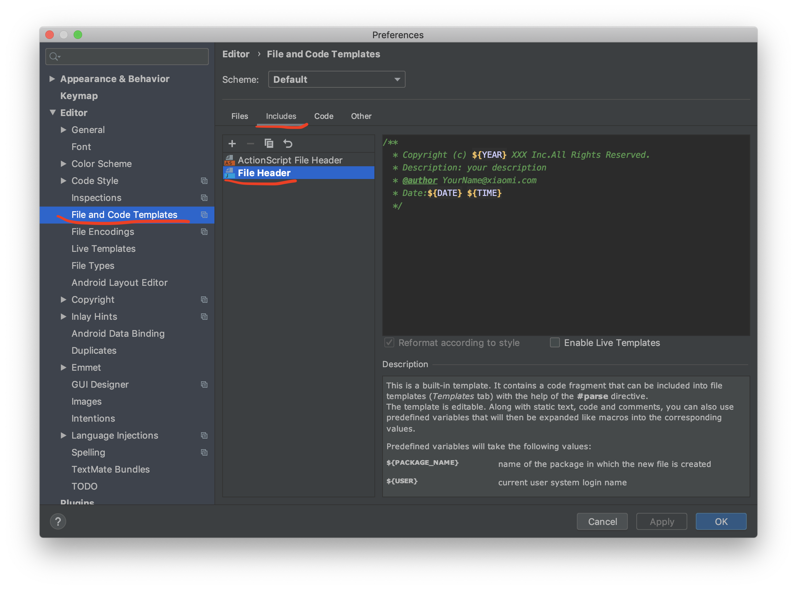

# Java 代码规范

## 建议代码编辑器
**IntelliJ IDEA**

## 代码风格
对于一个团队而言，要形成规范的代码风格，需要一个统一的IDEA格式规范。<br>
这里推荐[Alibaba Java Code Guidelines](https://plugins.jetbrains.com/plugin/10046-alibaba-java-coding-guidelines), 可以通过IDEA的Plugin Market进行安装。<br>
具体的安装步骤详见👉[插件安装](https://github.com/alibaba/p3c/blob/master/idea-plugin/README_cn.md)

## 规范文件头
良好风格的文件头，能够帮助你快速明确改文件的用途以及联系人，出现问题的时候能够找到代码作者。

!!! note "在IDEA中如何设置"
    - MAC: Preferences --> Editor --> File and Code Templates --> Includes --> File Header
    - Linux/Windows: Settings --> Editor --> File and Code Templates --> Includes --> File Header
```text
/**
  * Copyright (c) ${YEAR} XiaoMi Inc.All Rights Reserved.
  * Description: your description（该位置需要自己每次创建一个类的时候写上）
  * @author YourName@xiaomi.com
  * Date:${DATE} ${TIME}
  */
```


